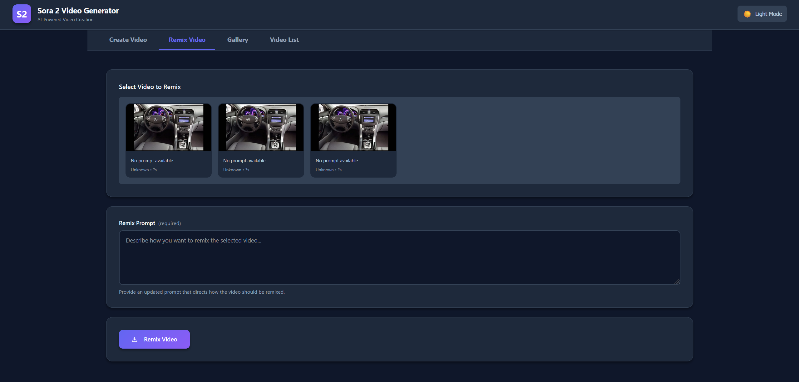

# Sora 2 API Client

A Python client for interacting with the OpenAI Sora 2 video generation API.

## Features

- 🔐 Secure API key management using environment variables
- 🎬 Easy video generation with text prompts
- 📊 Real-time progress tracking with polling
- ⏳ Automatic wait-for-completion support
- 🌐 **Web Interface** - Modern GUI for creating and managing videos
- ✅ Connection testing
- 🛠️ Modular and extensible design

## Screenshots

### Create Videos

Generate videos from text prompts with optional reference images and customizable parameters.

### Gallery View

Browse your generated videos with thumbnails and animated hover previews.

### Video Remix

Transform existing videos with new creative prompts.

### Video Management

Manage your video library with download and delete options.

## Quick Start

### Web Interface (Recommended)

For a visual, user-friendly experience:

```bash
# Install dependencies
pip install -r requirements.txt

# Run the web server from the src/app directory
cd src/app
python web_app.py
```

Then open **http://localhost:5000** in your browser.

📖 See [WEB_INTERFACE.md](WEB_INTERFACE.md) for full documentation.

### Command-Line Interface

For automation and scripting, use the CLI:

```bash
# Run from the src/api directory
cd src/api
python sora_api.py create --prompt "A sunset over the ocean" --wait
```

📖 See [CLI_USAGE.md](CLI_USAGE.md) for detailed CLI documentation.

## Setup

### Prerequisites

- Python 3.7 or higher
- OpenAI API key with Sora 2 access

### Installation

1. Clone or navigate to the repository:
```bash
cd c:\dev\Sora
```

2. Install required dependencies:
```bash
pip install -r requirements.txt
```

### API Key Configuration

**Important**: Your API key should NEVER be committed to the repository.

Create a `.env` file in the project root:

```bash
# .env file
OPENAI_API_KEY=sk-proj-your-actual-api-key-here
```

The `.env` file is automatically ignored by git and will be loaded by the API client.

## Usage

### Web Interface

The web interface provides an intuitive GUI for:
- Creating videos from text prompts
- Remixing existing videos
- Viewing gallery with video thumbnails and animated previews
- Downloading videos locally
- Managing and deleting videos

See [WEB_INTERFACE.md](WEB_INTERFACE.md) for complete documentation.

### Command-Line Interface

For detailed CLI usage, see [CLI_USAGE.md](CLI_USAGE.md).

Quick examples:

```bash
# Navigate to the API directory
cd src/api

# Create a video
python sora_api.py create --prompt "A sunset over the ocean" --wait

# Remix a video
python sora_api.py remix --video-id video_abc123 --prompt "Make it sunrise instead" --wait

# List videos
python sora_api.py list --limit 20

# Download a video
python sora_api.py download --video-id video_abc123 --all
```

### Video Info Auto-Save

By default, when a video completes (status = "completed"), the script automatically saves:
- The complete API response
- All creation parameters used
- Timestamp of when the info was saved

The file is saved as `videos/<video_id>.json`. To disable this:

```bash
python sora_api.py create --prompt "Test" --wait --no-save
```

### Using the Client in Your Own Scripts

```python
# Add src/api to your Python path or run from that directory
import sys
sys.path.append('src/api')
from sora_api import SoraAPIClient

# Initialize client
client = SoraAPIClient()

# Test connection
if client.test_connection():
    # Option 1: Create a video and wait for completion automatically
    completed_video = client.create(
        prompt="A majestic eagle soaring through the clouds",
        seconds="5",
        size="1920x1080",
        wait_for_completion=True  # Polls until complete and shows progress
    )
    
    print(f"Video completed! ID: {completed_video['id']}")
    
    # Save video info to JSON
    client.save_video_info(completed_video, creation_args={
        "prompt": "A majestic eagle soaring through the clouds",
        "seconds": "5",
        "size": "1920x1080"
    })
    
    # Option 2: Create video and manually wait later
    video_job = client.create(
        prompt="Your video prompt here",
        seconds="5",
        size="1920x1080"
    )
    
    video_id = video_job['id']
    
    # Manually wait for completion with progress tracking
    try:
        completed = client.wait_for_completion(
            video_id,
            poll_interval=3,      # Check every 3 seconds
            max_wait_time=600,    # Timeout after 10 minutes
            show_progress=True    # Display progress bar
        )
        print("Video generation complete!")
    except TimeoutError:
        print("Video took too long to generate")
    except Exception as e:
        print(f"Error: {e}")
    
    # Option 3: Check status manually without waiting
    video_info = client.retrieve(video_id)
    print(f"Video status: {video_info['status']}")
    print(f"Progress: {video_info.get('progress', 0)}%")
    
    # Once completed, download the video
    if video_info['status'] == 'completed':
        client.save_video(video_id, "output.mp4")
    
    # Create a remix of the video
    remix_job = client.remix(
        video_id=video_id,
        prompt="Same scene but with different lighting"
    )
    
    # List all your videos
    videos = client.list(limit=10, order="desc")
    for video in videos.get('data', []):
        print(f"Video {video['id']}: {video['prompt']}")
```

## Project Structure

```
c:\dev\Sora\
├── .git/                   # Git repository
├── .gitignore              # Git ignore rules
├── .env                    # Environment variables (NOT in git)
├── requirements.txt        # Python dependencies
├── README.md               # This file
├── CLI_USAGE.md            # CLI documentation
├── WEB_INTERFACE.md        # Web interface documentation
├── DEPLOYMENT.md           # Production deployment guide
├── QUICKSTART.md           # Quick reference guide
├── resources/              # Screenshots and media
│   ├── Create.png
│   ├── Gallery.png
│   ├── Remix.png
│   └── VideList.png
├── src/
│   ├── api/
│   │   ├── __init__.py
│   │   └── sora_api.py     # Main API client
│   └── app/
│       ├── __init__.py
│       ├── web_app.py      # Flask web application
│       └── templates/
│           └── index.html  # Web interface
├── videos/                 # Downloaded videos (NOT in git)
├── temp/                   # Temporary files (NOT in git)
└── ref/                    # API reference documentation
```

## Security Notes

⚠️ **Important Security Information**:

- `.env` file is excluded from git via `.gitignore`
- Never commit your API key to version control
- `videos/` and `temp/` directories are excluded from git
- Always use environment variables for API keys in production

## API Reference

### SoraAPIClient Class

#### `__init__(api_key=None)`
Initialize the client with an optional API key. If not provided, reads from `OPENAI_API_KEY` environment variable.

#### `create(prompt, model="sora-2", input_reference=None, seconds=None, size=None)`
Create a video using the Sora 2 API.

**Parameters:**
- `prompt` (str): Text prompt that describes the video to generate (Required)
- `model` (str): The video generation model to use. Defaults to "sora-2"
- `input_reference` (file): Optional image reference that guides generation
- `seconds` (str): Clip duration in seconds. Defaults to 4 seconds
- `size` (str): Output resolution formatted as width x height. Defaults to 720x1280

**Returns:**
- dict: The newly created video job

**Example:**
```python
result = client.create(
    prompt="A serene sunset over a calm ocean",
    model="sora-2",
    seconds="5",
    size="1920x1080"
)
```

#### `remix(video_id, prompt)`
Create a video remix based on an existing video.

**Parameters:**
- `video_id` (str): The identifier of the completed video to remix (Required)
- `prompt` (str): Updated text prompt that directs the remix generation (Required)

**Returns:**
- dict: The newly created remix video job

**Example:**
```python
result = client.remix(
    video_id="video_123",
    prompt="The same scene but now at sunrise"
)
```

#### `list(after=None, limit=None, order=None)`
List videos in the organization.

**Parameters:**
- `after` (str): Identifier for the last item from the previous pagination request
- `limit` (int): Number of items to retrieve
- `order` (str): Sort order by timestamp. Use 'asc' or 'desc'

**Returns:**
- dict: A paginated list of video jobs

**Example:**
```python
videos = client.list(limit=10, order="desc")
```

#### `retrieve(video_id)`
Retrieve information about a specific video.

**Parameters:**
- `video_id` (str): The identifier of the video to retrieve (Required)

**Returns:**
- dict: The video job matching the provided identifier

**Example:**
```python
video = client.retrieve("video_123")
```

#### `delete(video_id)`
Delete a video.

**Parameters:**
- `video_id` (str): The identifier of the video to delete (Required)

**Returns:**
- dict: Deletion confirmation response

**Example:**
```python
result = client.delete("video_123")
```

#### `get_content(video_id, variant=None)`
Download video content.

**Parameters:**
- `video_id` (str): The identifier of the video whose media to download (Required)
- `variant` (str): The variant of the video to download

**Returns:**
- bytes: The video file content

**Example:**
```python
content = client.get_content("video_123")
```

#### `save_video(video_id, filename, variant=None)`
Download and save video content to a file.

**Parameters:**
- `video_id` (str): The identifier of the video to download (Required)
- `filename` (str): The filename to save the video as (Required)
- `variant` (str): The variant of the video to download

**Returns:**
- str: The path to the saved file

**Example:**
```python
filepath = client.save_video("video_123", "my_video.mp4")
```

#### `test_connection()`
Test the API connection.

**Returns:**
- bool: True if connection is successful

## Available Endpoints

The Sora 2 API client implements all official Video endpoints:

- **POST /v1/videos** - Create a video
- **POST /v1/videos/{video_id}/remix** - Create a video remix
- **GET /v1/videos** - List videos
- **GET /v1/videos/{video_id}** - Retrieve a specific video
- **DELETE /v1/videos/{video_id}** - Delete a video
- **GET /v1/videos/{video_id}/content** - Download video content

All methods use `sora-2` as the default model.

## Troubleshooting

### "API key not found" error
- Make sure you've run `setup_env.bat` before running Python scripts
- Verify that `test.txt` exists and contains your API key

### "API connection failed" error
- Check that your API key is valid
- Verify you have access to the Sora 2 API
- Check your internet connection

## License

This is a personal project. Use at your own discretion.
